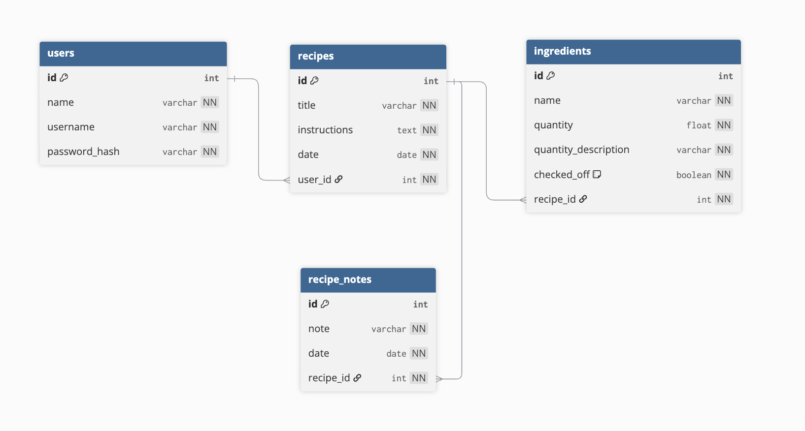

# Meal and Grocery Planner
My fullstack app with a Python Flask backend and React frontend makes meal planning and grocery shopping simple and stress-free. <br>
Features:
* Discover and explore recipes by cuisine
* Add your own recipes
* Schedule and view or edit them on your calendar
* Automatically generate a weekly grocery list based on planned dishes 

## Skills Practiced
* User authentication with JSON Web Tokens (JWT)
* Model and schema validations
* Filtering and manipulating data from an API
* React router
* Full CRUD functionality
* Connecting a flask backend to a react frontend

## Models/Tables


## Database
Postgres through Neon <br>
https://neon.com/

## Endpoints
* ` POST /signup` <br>
Allow users to create an account
* `POST /login` <br>
Users can login to their account by entering their username and password <br>
JSON Web Token created upon login
* `GET /me` <br>
Returns the user if the user is logged in 
* `GET /api/recipes` <br>
Get all recipes <br>
User's can only view their own recipes, verified with their JWT
* `POST /api/recipes` <br>
Users can create a recipe
* `GET /api/recipes/<int:recipe_id>` <br>
Get one recipe by the recipe id 
* `PATCH /api/recipes/<int:recipe_id>` <br>
User's can edit their recipe
* `DELETE /api/recipes/<int:recipe_id>` <br>
User's can delete one of their recipes
* `POST /api/recipes/<int:recipe_id>/ingredients` <br>
Create an ingredient (associated with a recipe)
* `PATCH /api/recipes/<int:recipe_id>/ingredients/<int:id>` <br>
Edit an ingredient (user's can only edit their own)
* `DELETE /api/recipes/<int:recipe_id>/ingredients/<int:id>` <br>
User's can delete an ingredient associated with one of their recipes
* `POST /api/recipes/<int:recipe_id>/notes` <br>
Create a recipe note (associated with a recipe)
* `PATCH /api/recipes/<int:recipe_id>/notes/<int:id>` <br>
Edit a recipe note (user's can only edit their own)
* `DELETE /api/recipes/<int:recipe_id>/notes/<int:id>` <br>
User's can delete one of their recipe notes
* `GET recipes/cuisine/<string:cuisine>` <br>
Retrieve recipes from Spoonacular API by cuisine
* `GET /recipes/information/<int:recipe_id>` <br>
Retrieve information for a specific recipe from Spoonacular API

## Getting Started
* Clone the repo onto your machine
  ```bash
  git clone <your-repo-url>
  cd <your-project-directory>
  ```
  ### Backend
* Create a virtual environment
  ```bash
  cd server
  virtualenv venv
  source venv/bin/activate
  ```
* Install necessarry dependencies
  ```bash
  (in server directory)
  pip install -r requirements.txt
  ```
  ### Set up .env.local file
* Add a database url to the .env.local file 
  - create new project in Neon
  - click on `Connect`
  - click on the .env tab and copy the the `DATABASE_URL`
  - paste it into server/.env.local file <br>
  <br>
* Create a JSON Web Token Secret Key (can be anything) and paste into server/.env.local file <br>
<br>

* Get an api key from spoonacular API and paste into server/.env.local file (https://spoonacular.com/food-api) 
  - go to the pricing tab
  - click "get started" on the free option
  - go to "profile & API Key"
  - copy your personal API key and paste into server/.env.local file <br>
  <br>
* Run migration and seed the database (seeding is optional, you will be able to make your own account and add your own data in the app)
  ```bash
  (from the project root directory)
  FLASK_APP=server flask db migrate
  FLASK_APP=server flask db upgrade
  python seed.py
  ```
* Starting the backend server
  ```bash
  (from the project root directory) 
  python run.py
  ```
  ### Frontend
* install necessarry dependencies
  ```bash
  cd client
  npm install
  ```
* Starting the frontend
  ```bash
  (from the client directory and separate terminal from the backend server)
  npm run dev 
  ```
* Copy the localhost link into your browser to view and interact with the application <br>
http://localhost:5173/

### Future refactors
1. The API I chose to use had some limitations such as not allowing me to store data in a database and only allowing 50 API calls a day with the free version. Due to this, my application currently does not allow saving the recipes from the api, only viewing them. With more time, I will figure out how to work around these limitations or find a different way to let users browse recipes such as creating a file with recipes I have found myself and using that instead of the api. <br> <br>
2. Also due to time constraints, my application does not currently use my table for recipe notes. In the future I would like to add in a page where you can search for a recipe and view any notes you have made about that recipe. 